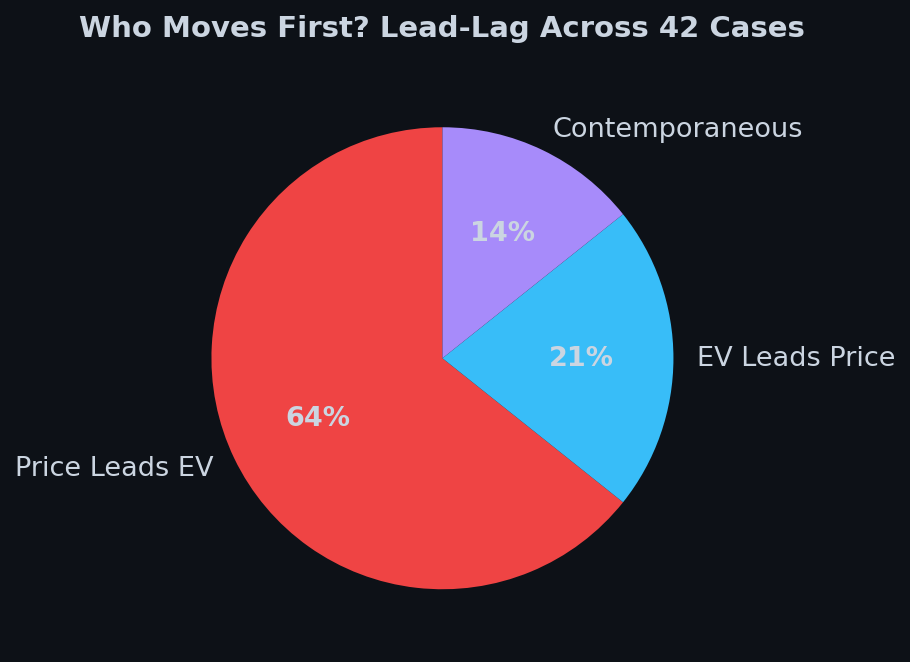
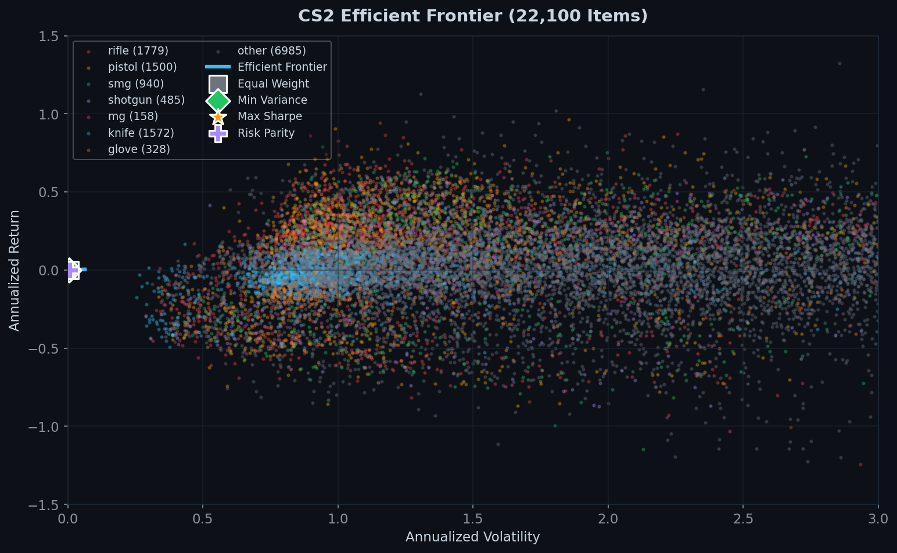

# CS2 Quantitative Research

Market microstructure, portfolio theory, and pricing dynamics applied to Counter-Strike 2 digital asset markets. Built on 5 years of daily price data from 70+ exchanges via the [PriceEmpire API](https://pricempire.com/).


## Studies

### [Case EV vs Price Dynamics](https://github.com/cgarryZA/case-ev)

Does the expected value of a case's contents predict future case price changes? Cointegration, lead-lag analysis, and z-score trading signals across 42 CS2 cases.

**Key finding**: Price leads EV in 64% of cases — speculative demand moves first, contents adjust. The EV/Price ratio is the strongest cross-sectional predictor of case returns.



### [Portfolio Efficient Frontier](https://github.com/cgarryZA/portfolio-frontier)

Markowitz mean-variance optimization across 22,100 CS2 items. Efficient frontier, Ledoit-Wolf covariance estimation, and optimal portfolio construction for digital asset markets.



## Quick Start

```bash
git clone --recurse-submodules https://github.com/cgarryZA/Quant.git
cd Quant
python -m http.server 8001
# Open http://localhost:8001
```

The landing page links to each study. All dashboards use precomputed data and work immediately.

## Architecture

```
Quant/                          Landing page + study navigation
  studies/
    case-ev/                    git submodule -> cgarryZA/case-ev
    portfolio-frontier/         git submodule -> cgarryZA/portfolio-frontier
```

Each study is a standalone repo that can also be cloned independently:

```bash
git clone https://github.com/cgarryZA/case-ev.git
cd case-ev && python -m http.server 8000
```

## Data Pipeline

```
PriceEmpire API -> CSGO/Data (local warehouse) -> per-study export -> precompute.py -> JSON -> dashboard
```

Raw price data (10GB+, 70 providers) is hosted on Google Drive with restricted access. Each study has a `setup_data.py` script to download it. Precomputed analysis JSONs are committed directly to each repo.

## Data Scale

| Metric | Value |
|--------|-------|
| Cases analyzed | 42 |
| Unique items | 22,100+ |
| Market providers | 70+ |
| Date range | 2021-03-24 to 2026-03-24 |
| Trading days | 1,804 |
| Analysis modules | 10 per case |

## Author

Christian Garry — [github.com/cgarryZA](https://github.com/cgarryZA)
